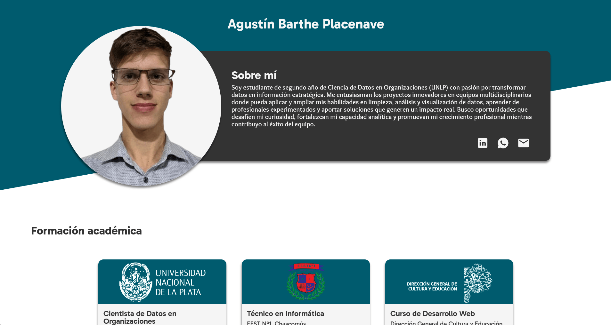

# Simple Portfolio

A clean, modern personal resume website built with HTML and CSS. This project was created as part of [The Odin Project curriculum](https://www.theodinproject.com/) to practice responsive design.

visit the [live demo](https://fran-dv.github.io/simple-portfolio/)

## About the project

A simple, professional resume website provided by The Odin Project as part of its Full-Stack JavaScript curriculum. The assignment included designs for mobile, tablet and desktop viewports to follow. I took the opportunity to build the real professional resume of a friend, so I adapt the design to his needs.

- Visit the [**Original assignment**](https://www.theodinproject.com/lessons/node-path-advanced-html-and-css-homepage)

- **Technologies:** HTML5, CSS3, Flexbox, Responsive Media Queries.
